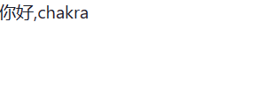
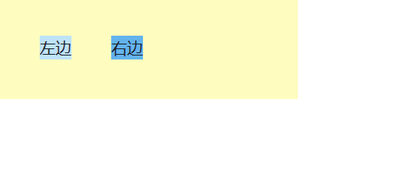
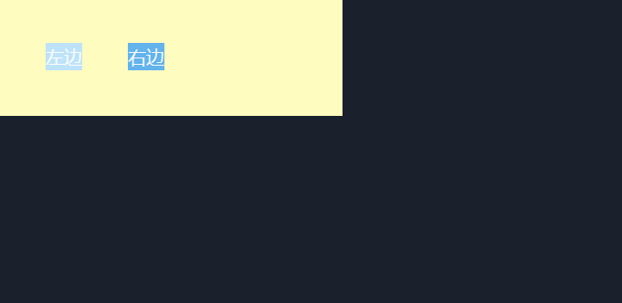
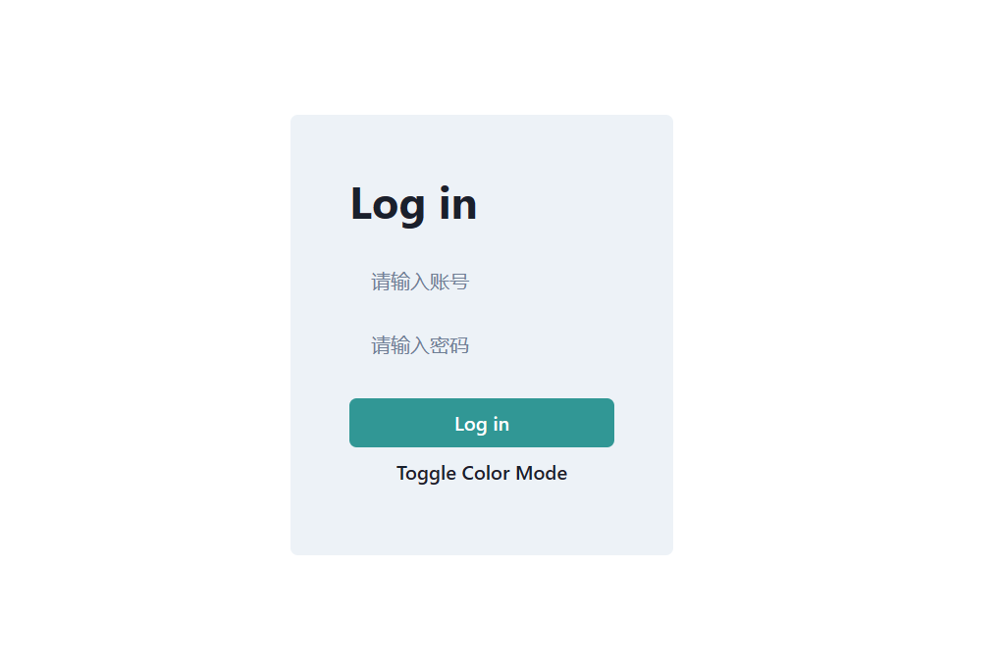
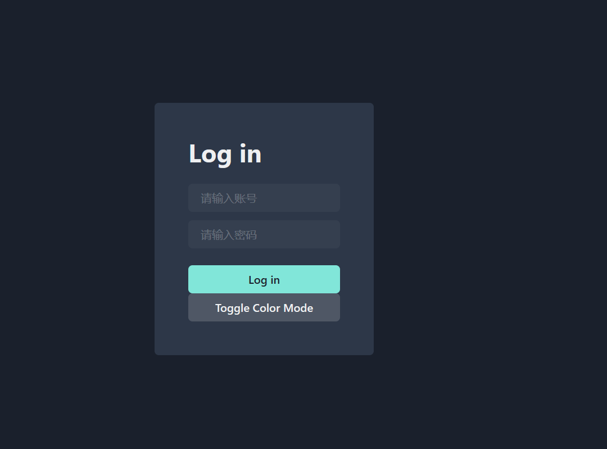
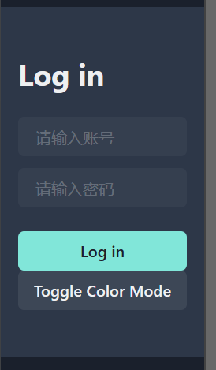

# 三分钟学会 Chakra-UI 写一个厉害的登录页
## 起步
老规矩创建一个项目用 `vscode` 打开
```
npm create vite chakra-demo --template react
cd chakra-demo
code .
```
打开后删除 `src` 下的其他文件夹，只保留 `App.jsx` 和 `main.jsx` 
   
写入以下代码   
`App.jsx`
```js
function App() {
  return <h1>你好,chakra</h1>
}

export default App

```
`main.jsx`
```js
import React from 'react'
import ReactDOM from 'react-dom/client'
import App from './App'

ReactDOM.createRoot(document.getElementById('root')).render(
  <React.StrictMode>
    <App />
  </React.StrictMode>,
)
```
准备好这些以后 安装 `chakra` 并且安装一下依赖 把程序 `run` 起来
```
npm i @chakra-ui/react @emotion/react @emotion/styled framer-motion
npm i
npm run dev
```
   
然后打开我们的  `main.jsx` 写入以下代码
```js
import React from 'react'
import ReactDOM from 'react-dom/client'
import App from './App'
import { ChakraProvider } from '@chakra-ui/react' // 引入

ReactDOM.createRoot(document.getElementById('root')).render(
  <React.StrictMode>
    {/* 包住我们的App组件 */}
    <ChakraProvider> 
      <App />
    </ChakraProvider>
  </React.StrictMode>,
)
```
这个时候返回浏览器就会发现 
   
哎？俺的 `h1` 怎么变的这么小只了，不用慌这说明 `chakra` 已经起作用了。

## 组件和样式
打开 `App.jsx` 写入以下代码
```js
import { Box, Flex } from "@chakra-ui/react"

function App() {
  return (
    <Flex w='300px'  p='10'  bg='yellow.100'>
      <Box  mr='10' bg='blue.100'>左边</Box>
      <Box bg='blue.300'>右边</Box>
    </Flex>
  )
}
export default App
```
打开浏览器
   
发生了什么？ 我们 `F12` 审查元素发现， 原来 `Flex` 就是设置了 `flex` 的 `div` `Box` 就是普通的 `div`
   
那 `w` `p` `bg` `mr` 都是些啥呢？其实通过效果图不难发现
- `w` 就是 `width`
- `p` 就是 `padding`
- `bg` 就是 `background`
- `mr` 就是 `margin-right`
- `blue.100` 就是蓝色  `blue.300` 就是更蓝

怎么样，是不是灰常的方便。但是这并不算啥，我们来点更厉害的。   
`App.jsx`
```js
import { Box, Flex,useColorMode } from "@chakra-ui/react"
function App() {
  const { toggleColorMode } = useColorMode() // 创建 toggleColorMode

  return (
    <Flex w='300px' p='10' bg='yellow.100'>
      {/* 点击 左边 执行 toggleColorMode */}
      <Box onClick={toggleColorMode}  mr='10' bg='blue.100'>左边</Box>
      <Box bg='blue.300'>右边</Box>
    </Flex>
  )
}
export default App
```
现在我们打开浏览器点击左边 就会发现
   
网页变成了 暗色模式，如果你再次点击 又会变成正常模式，但是我们的背景色并没有改变，我们来设置一下。   
`App.jsx`

```js
import { Box, Flex,useColorMode,useColorModeValue } from "@chakra-ui/react"
function App() {
  const { toggleColorMode } = useColorMode() 
  // useColorMode 第一个参数是浅色模式颜色 第二个是深色模式颜色
  const backColor = useColorModeValue('yellow.100','red.100')

  return (
    // 这用上我们刚刚创建的颜色
    <Flex w='300px' p='10' bg={backColor} >
      <Box onClick={toggleColorMode}  mr='10' bg='blue.100'>左边</Box>
      <Box bg='blue.300'>右边</Box>  
    </Flex>
  )
}
export default App
```
再次打开浏览器就会发现，深色模式和浅色模式对应的背景色发生了改变。
   
好吧，虽然这样很丑。。。

## 来点厉害的
根据我们刚刚学的技能，稍微组合一下再加亿点点细节。   
`App.jsx`
```js
// 这里引入 chakra-ui 提供的 Heading,Input,Button 组件
import { Flex,Heading,Input,Button, useColorMode,useColorModeValue } from "@chakra-ui/react"
function App() {
  const { toggleColorMode } = useColorMode() 
  const backColor = useColorModeValue('gray.100','gray.700')

  return (
    <Flex h='100vh' alignItems='center' justifyContent='center'>
      <Flex direction="column" bg={backColor} p='12' rounded={6} >
        <Heading mb={6}> Log in</Heading>
        <Input placeholder="请输入账号" mb={3} variant="filled" type='text' />
        <Input placeholder="请输入密码" variant="filled" mb={6} type='password' />
        <Button colorScheme='teal'>Log in</Button>
        <Button onClick={toggleColorMode}> Toggle Color Mode </Button>
      </Flex>
    </Flex>
  )
}
export default App
```
打开浏览器
   
点击 `Toggle Color Mode` 按钮
   
缩小一下页面
   

ok 恭喜你已经学会了基础操作，快去[官网](https://chakra-ui.com/)学习更多细节吧。
---
> 如果本文对你有帮助，可以去 Github 给我的博客点个 star 嘛    
> **https://github.com/zuoFeng59556/my-blog**